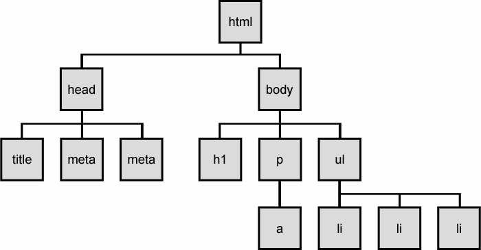

##Working with JavaScript, jQuery and the DOM:##

###Get familiar with documents and the DOM###

- A web page is a document
	- The document is displayed in the browser window or as the HTML source code
- The DOM is a programming interface for HTML and XML
	- DOM stands for Document Object Model
	- It provides a calculated representation of the document
	- It connects web pages to scripts and programming languages
	- It can be modified with a scripting language like JavaScript

***DOM Tree***




###Include JavaScript in your document###

- JavaScript uses the DOM to access the document and it's elements
- You can write JavsScript inline within a script element
- You can also link from a .js file within your project directory
		
**Writing JS inline:**

```
<body>
 // Your HTML Content
 <script type="text/javascript">
 	console.log('Hello World!")
 </script>
</body>
```
**Inlcuding JS by linking to .js file:**

```
<body>
 // Your HTML Content
 <script type="text/javascript" src="scripts/main.js"></script>
</body>
```

###Include jQuery in your document##

- Make sure jQuery is included in your document before JavaScript if you plan to use jQuery. This way you can write jQuery syntax within your JavaScript
- Include jQuery in the head of your document or just before the end of the body
- You can download the files from http://jquery.com/download/
	- The uncompressed version is good for debugging while in development
	- The compressed version is better for performance while in production due to reduced file size
	- Include by saving to your project directory and linking via script tag	

- You can also include via CDN
	- The jQuery file is served to the web via jQuery.com
	- CDN has performance benefits while in production. if the visitor to your webpage has already downloaded a copy of jQuery from the same CDN, it won't have to be re-downloaded
	- Include by linking to jQuery servers via the script tag	
**Downloaded files saved to your directory:**

```
<head>
  <title>Title</title>
  <link type="text/css" rel="stylesheet" href="styles/main.css"></link>
  <script src="scripts/jquery-1.11.1.min.js"></script>
</head>
```	
**Via CDN:**

```
<head>
  <title>Title</title>
  <link type="text/css" rel="stylesheet" href="styles/main.css"></link>
  <script src="//code.jquery.com/jquery-1.11.0.min.js"></script>
</head>
```
**Before the closing body tag:**

```
<body>
  // Your HTML Content
  // jQuery first
  <script src="scripts/jquery-1.11.1.min.js"></script>
  // Then include your JavaScript
  <script type="text/javascript" src="scripts/main.js"></script>
</body>
```

###Use the console in your browser###

- In Google Chrome "alt + command + j"
	- or by inpecting element and selecting "Console"
- Write a console log from your document or .js file so you know it's connected

```
<body>
 // Your HTML Content
 <script type="text/javascript">
 	console.log('Hello World!")
 </script>
</body>
```
**Console**

```
Hello World!
```
- Read any errors that may be present.
- The console will show an error message if it cannot find another file linked to your document. Check the corresponding file path and correct if necessary.
	- This applies not only to .js files but also to .css, images, fonts, etc..

**Example error message**

```
Failed to load resource: 
net::ERR_FILE_NOT_FOUND 
	file://scripts/main.jumboshrimp
```
- You can write JavaScript directly in the console. Code written in the console will be lost after browser refresh.

**Try some math**

```
1 + 2
	3
45 * 99
	4455
(36 * 67) / (84 - 79)
	482.4
```

###Resources:###

***Intro to the DOM***

- https://developer.mozilla.org/en-US/docs/Web/API/Document_Object_Model/Introduction

***Eloquent Javascript***

- http://eloquentjavascript.net/

***jQuery: Traversing and Manipulating the DOM***

- http://jqfundamentals.com/chapter/traversing-manipulating

***jQuery API Documentation***

- http://api.jquery.com/

***jQuery Cheatsheet***

- http://oscarotero.com/jquery/

***jQuery Fundamentals***

- http://jqfundamentals.com/

***Google Chrome Console***

- https://developer.chrome.com/devtools/docs/console

***Drew's Responsive Nav CodePen***

- http://codepen.io/drewbot/pen/RNNyZq

***Drew's Input Value Print to DOM CodePen***

- http://codepen.io/drewbot/pen/Qwwrvw

***Introduction to JavaScript types***

- http://learn.jquery.com/javascript-101/types/

***Complete JavaScript Syntax Guide***

- http://speakingjs.com/es5/index.html#pt03

